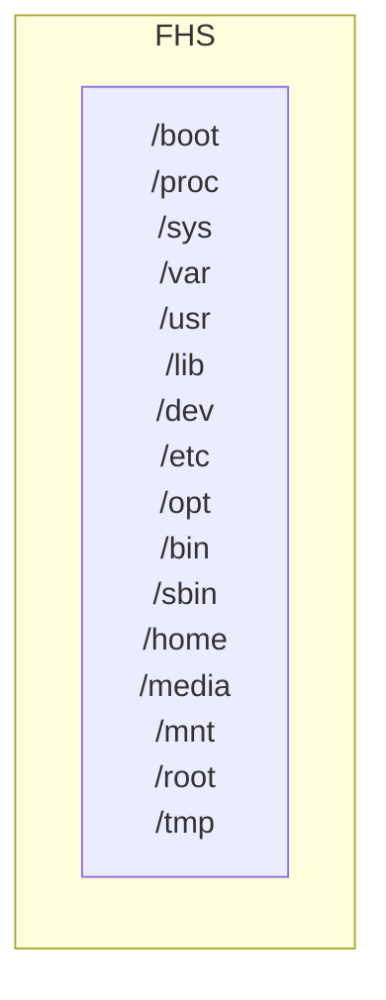
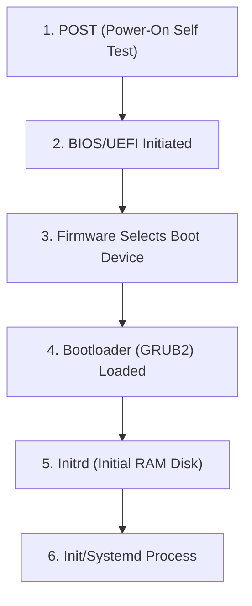

# Linux-Roadmap
Interactive roadmap/diagram outlining learning objectives from Comptia's Linux+ certification.

Inspired by [Roadmaps.sh](https://roadmap.sh/frontend), this project plans to outline a roadmap for Comptia's Linux+ certification [objectives](https://partners.comptia.org/docs/default-source/resources/comptia-linux-xk0-005-exam-objectives-(1-0)). Once functionally complete, it will have the potential to create roadmaps for other common certifications such as AWS, Azure, etc. Overall, this plans to be a comprehensive study tool outlining every objective on a given certification. 

Diagrams will be rendered using [Mermaid.js](https://mermaid.js.org/), where each node will be clickable, prompting a right side-view of a relevant article/notes. Most work is already completed on my personal [website](https://joebulfer.com/Linux/Linux%2B/1.+0+System+Management/1.1+Linux+Fundumentals) as far as writing, it is just a matter of converting the markdown files to HTML, building the diagrams, and creating a function to insert resective HTML into side-view for given button/node.

Here is what the diagram may look like covering 1.1: Linux Fundumentals.

